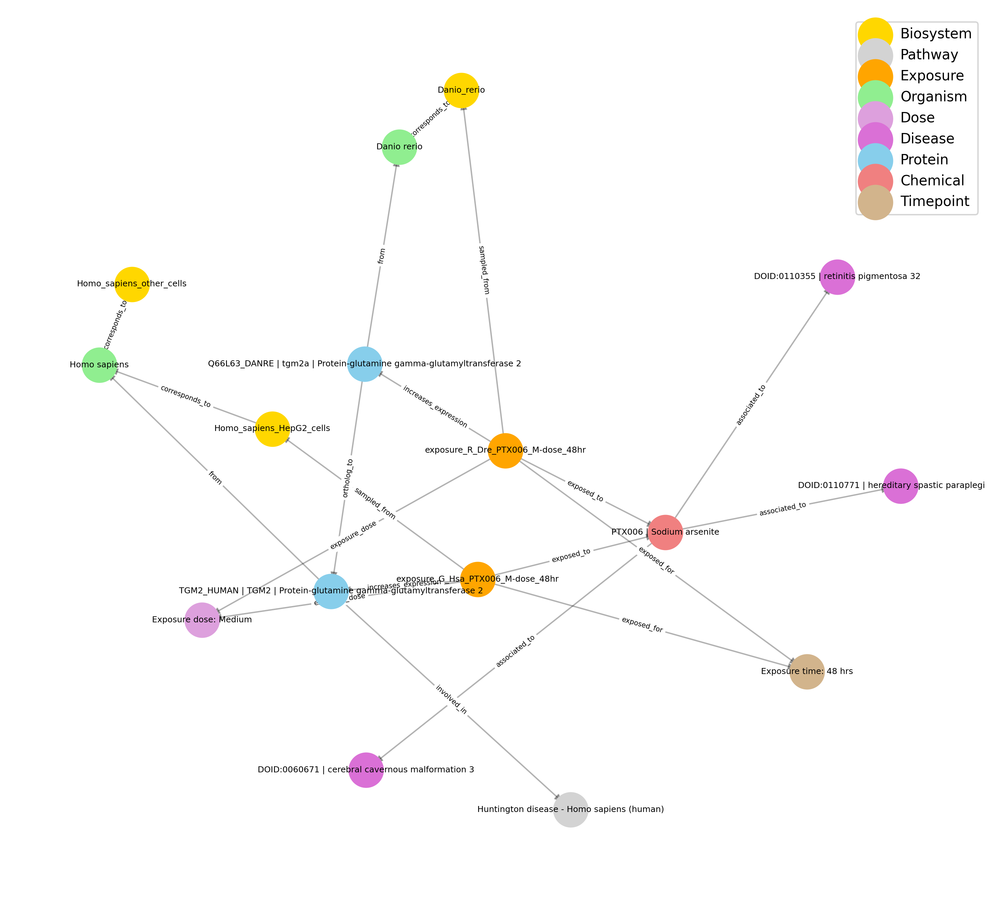

# PrecisionTox Knowledge Graph

Ptox Knowledge Graph is a project aimed at building and managing a knowledge graph for Ptox-related data. This repository contains the source code and documentation to construct a knowledge graph via querying the current production version of the PrecisionTox Central Database.


## Getting Started

1. **Clone the repository:**
    ```bash
    git clone https://github.com/yourusername/ptox_kg.git
    cd ptox_kg
    ```

2. **Install dependencies:**
    ```bash
    pip install -r requirements.txt
    ```

3. **Run the application:**
    ```bash
    python main.py
    ```

## Requirements

- Configure parameters for connecting to Ptox Central Database (PostgreSQL) in `config.yaml` and build the complete knowledge graph.
- Alternatively, a sample knowledge graph is provided.

## Graph description

| Node Type      | Description                       | Attributes      |
|----------------|-----------------------------------|------------------------|
| Chemical       | Compound selected for toxicity assessment      | PTX code, name   |
| Biosystem       | Experimental system         |  name, code      |
| Organism       | Species of experimental biosystem      | scientific name, common name, UniProt name |   
| Protein   | Single portein subject to expression changes         | UniProt Acc, UniProt ID, gene name, description          |
| Pathway  |  Biological pathway  | name, id, source |
| Disease      | Disease                | name, identifier (DOID)        |
| Exposure | Exposure experiment | | -
| Timepoint | Duration of chemical exposure | exposure time (hrs) |
| Dose  | Dose of chemical in exposure: high, medium, low or control |  code, name, description |

| Edge Type      | Source Node   | Target Node   | Description                |  Attributes |
|----------------|--------------|--------------|----------------------------|-------------|
| associated_to     | Chemical     | Disease       | Diseases associated to entity according to literature   | pubmed_count, pubmed_ids, socioaffinity_score, z_score | 
| corresponds_to       | Biosystem     | Organism   | Organism to with experimental system corresponds to |  |
| from    | Protein | Organism     | Organism where protein comes from | |
| ortholog_to  | Protein     | Protein | Ortholog proteins | score |
| involved_in  | Protein | Pathway | Pathway where protein participates | |
| sampled_from | Exposure | Biosystem | | |
| exposed_to  | Exposure | Chemical | | |
| exposed_for | Exposure | Timepoint | | |
| exposure_dose | Exposure | Dose | | |
| increases/decreases_expression | Exposure | Protein | Change in protein expression | log2_FC, adj_pval |

#### Small subset showcasing knowledge graph organization

